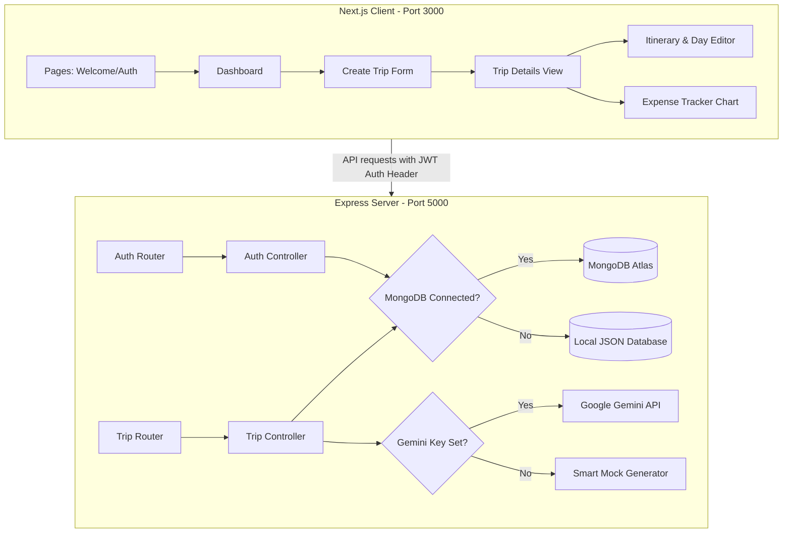

# AI Travel Planner

A full-stack web application that allows users to generate customizable travel itineraries and budgets using Gemini AI. Users can view day-by-day activities, manually adjust schedules, ask the AI to regenerate specific days with custom prompts, recommendations for lodgings, and track actual expenditures against the estimates using a built-in interactive tracker.

Designed with a clean, bright **light-blue minimalistic aesthetic** (strictly light theme) for high usability and ease of navigation.

---

## 🌟 Features

- **User Authentication**: Secure user registration and login utilizing JWT tokens with database-level isolation.
- **AI Itinerary Generation**: Day-by-day schedules with descriptions, times, and costs tailored to destination, length, and interests.
- **AI Budget Estimation**: Broken down into Flights, Accommodation, Dining, and Activities.
- **Dynamic Modifications**: Users can add, modify, or remove activities, and ask the AI agent to redesign specific days (e.g., "add more nature walks").
- **Hotel Suggestions**: Automated lodging suggestions grouped by budget tiers (Budget, Mid Range, Luxury) complete with traveler ratings.
- **[Creative Custom Feature] Interactive Expense Tracker**: A live budget comparison tool. Users can input real-world receipts during their trip. The app calculates totals and presents a visual comparison chart comparing estimated vs. actual expenses.
- **Graceful Fallbacks**:
  - **Database**: Automatically falls back to a local JSON-file-based database system under `backend/.data/` if MongoDB is unconfigured.
  - **AI Engine**: Seamlessly falls back to a smart mock LLM simulator if no Gemini API Key is supplied.

---

## 🛠️ Technology Stack

- **Frontend**: [Next.js](https://nextjs.org/) (React Framework, Page Routing, Client-side React Hooks)
- **Styling**: [Tailwind CSS](https://tailwindcss.com/) (Custom light-blue theme using the `sky`/`blue` palette)
- **Icons**: [Lucide React](https://lucide.dev/) (Minimalistic inline SVG icons)
- **Backend**: [Node.js](https://nodejs.org/) + [Express](https://expressjs.com/)
- **Database**: [MongoDB](https://www.mongodb.com/) via [Mongoose](https://mongoosejs.com/) OR a custom local file-system JSON database.
- **Language**: JavaScript (ES6+)

---

## 🧱 Architecture Explanation



### Authentication & Authorization Approach
1. **JSON Web Tokens (JWT)**: When a user registers or logs in, the backend hashes the password using `bcryptjs` and signs a JWT containing the user's ID.
2. **Authorization Middleware**: Secured routes pass through an `auth.js` middleware which validates the header token (`Bearer <token>`) and attaches the `userId` to `req.user`.
3. **Data Isolation**: Database models strictly partition queries using the `userId` field. Before performing any read, update, or deletion operation, the controller verifies that the resource's `userId` matches the authenticated `userId`. Attempts to query or modify other users' trips will result in a `403 Forbidden` error.

### AI Agent Design
- **Integration**: Communicates with the `gemini-1.5-flash` model via the `@google/generative-ai` SDK.
- **Structure Prompting**: Employs structural JSON constraints in the prompt templates to instruct the model to return data conforming strictly to our database schemas.
- **Inline Regeneration**: The day regeneration feature builds a prompt with the context of the destination and existing activities, injecting the user's specific request (e.g., "more outdoor activities"), and swaps the returned schedule in place without affecting other days.

### Creative Custom Feature: Interactive Budget & Expense Tracker
- **The Problem**: A travel planner stops once the trip begins. Standard travel planners do not bridge the gap between estimated budgets and real-world spending, causing users to easily overspend.
- **The Solution**: We built an **Interactive Expense Tracker** inside each trip dashboard. Users log expenses on the fly (categorized under flights, lodging, food, activities, or other). A live slider/progress meter compares the overall actual spending against the AI-estimated budget, warning users in orange/red if they overspend, or encouraging them in green if they remain under budget.

---

## ⚙️ Setup & Installation

Follow these steps to run the application locally.

### Prerequisites
- Node.js installed locally (v18 or higher recommended).
- A web browser.

### 1. Backend Setup
1. Open a terminal and navigate to the backend folder:
   ```bash
   cd backend
   ```
2. Copy the environment template:
   ```bash
   cp .env.example .env
   ```
3. Set your environment variables in `.env`. (By default, the server runs out-of-the-box on port `5000` using the local JSON-file database and mock AI, requiring no setup keys).
4. Start the backend:
   - For development (with auto-restart):
     ```bash
     npm run dev
     ```
   - For production:
     ```bash
     npm start
     ```

### 2. Frontend Setup
1. Open a new terminal window and navigate to the frontend folder:
   ```bash
   cd ../frontend
   ```
2. Copy the environment template:
   ```bash
   cp .env.example .env
   ```
3. Start the Next.js development server:
   ```bash
   npm run dev
   ```
4. Access the web interface at [http://localhost:3000](http://localhost:3000).

---

## 🌎 Deployment Guide

To deploy the application to a cloud host (such as Render, Vercel, or Heroku):

1. **Database**: Create a free cluster on [MongoDB Atlas](https://www.mongodb.com/cloud/atlas) and obtain a connection string. Set this as `MONGODB_URI` on your host.
2. **API Keys**: Get a free API Key from [Google AI Studio](https://aistudio.google.com/) and configure it as `GEMINI_API_KEY` on the backend host.
3. **Backend Deployment**:
   - Host the Node/Express app on a service like **Render** or **Railway**.
   - Configure the environment variables: `PORT`, `MONGODB_URI`, `JWT_SECRET`, and `GEMINI_API_KEY`.
4. **Frontend Deployment**:
   - Host the Next.js client on **Vercel** or **Netlify**.
   - Configure the environment variable: `NEXT_PUBLIC_API_URL` pointing to your deployed backend URL (e.g., `https://my-backend-app.onrender.com/api`).

---

## ⚠️ Known Limitations
- **Offline Mock Scope**: The offline mock itinerary service generates realistic schedules but picks activities from a predefined cyclical bank tailored to interests. For actual real-world dynamic generation, a `GEMINI_API_KEY` must be configured.
- **Local File DB Isolation**: When using the offline JSON fallback database, data is stored in the local file system. If deployed on serverless hosting (e.g., Render free tier) without MongoDB, changes will be wiped whenever the server restarts (ephemeral file system). A MongoDB Atlas instance is highly recommended for production.
